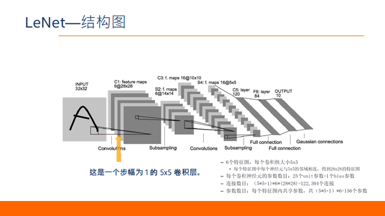
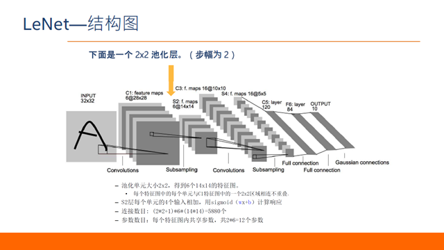
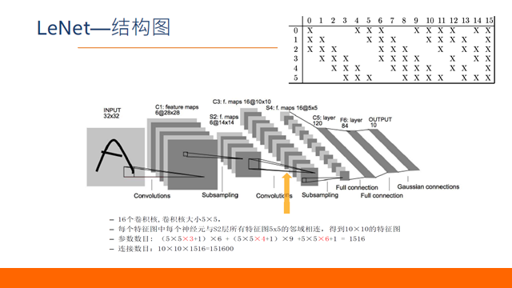
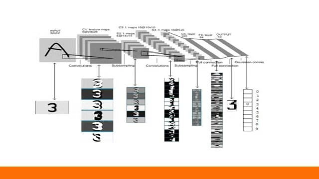

## 生物学

1. 感受野 Receptive Field

## 数学仿生
#### 卷积
- 一维卷积?
  
- 二维卷积 卷积核

## Convolutional Neural Network
#### 输入输出
- kernel
- 步长
- padding(共享权重)
- pooling(共享权重)
  - 平均池化
  - 最大池化

#### 例子：LeNet
卷积层：

池化层：

增加卷积核及第二次池化：

结果：

#### Deep Dive
- Relu：减少梯度爆炸 ？
- 参数少：防止过拟合
- 为何要两次卷积 ？

## 参考资料

#### 已看论文

#### 待看论文

#### 已看文章

#### 待看文章
